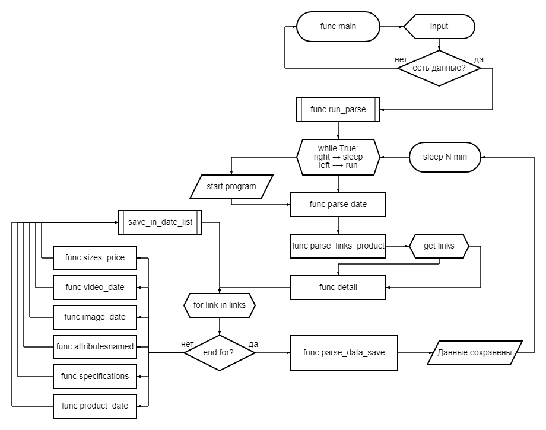

# Парсер

## Описание

Программа для парсинга сайта [с ювелирными изделиями](https://qgold.com/home).
Собирает данные с нескольких страниц по категорям и сохраняет данные в файл excel.

## Содержание

- [Базовый стек технологий](#основные-технологии)
- [Установка](#установка)
- [Зависимости](#зависимости)
- [Запуск](#запуск)
- [Принцип работы(блок схема)](#блок-схема)

***

### Основные технологии

- python >= 3.11
- asyncio
- pandas
- requests_html
- bs4
- lxml

Код стайл:

- black
- isort

### Установка

Клонировать проект:

```bash
git clone git@github.com:Aleks-Ti/BB_parse_BS4_static.git
```

### Зависимости

```bash
# Перейти в основную папку
cd main/

# Установить окружение проекта

source venv/Scripts/activate # or *nix (source venv/bin/activate)

# Установить зависимости проекта
pip install -r requirements.txt

python.exe -m pip install --upgrade pip
```

### Запуск

```bash
python main.py
```

### Блок схема


